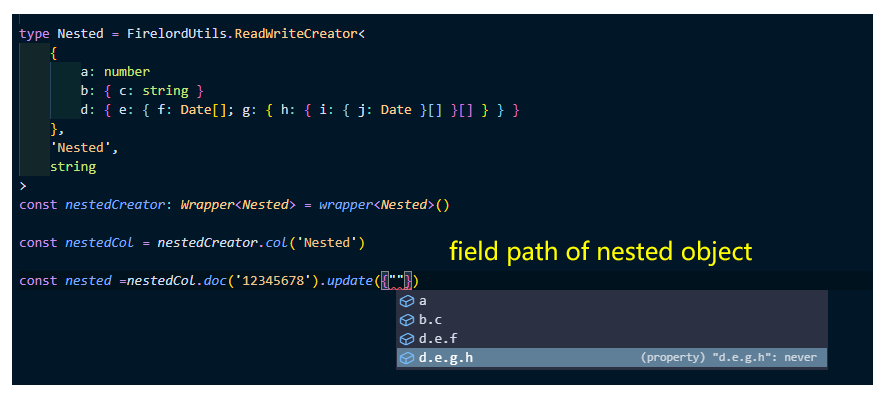
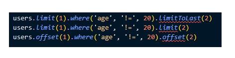
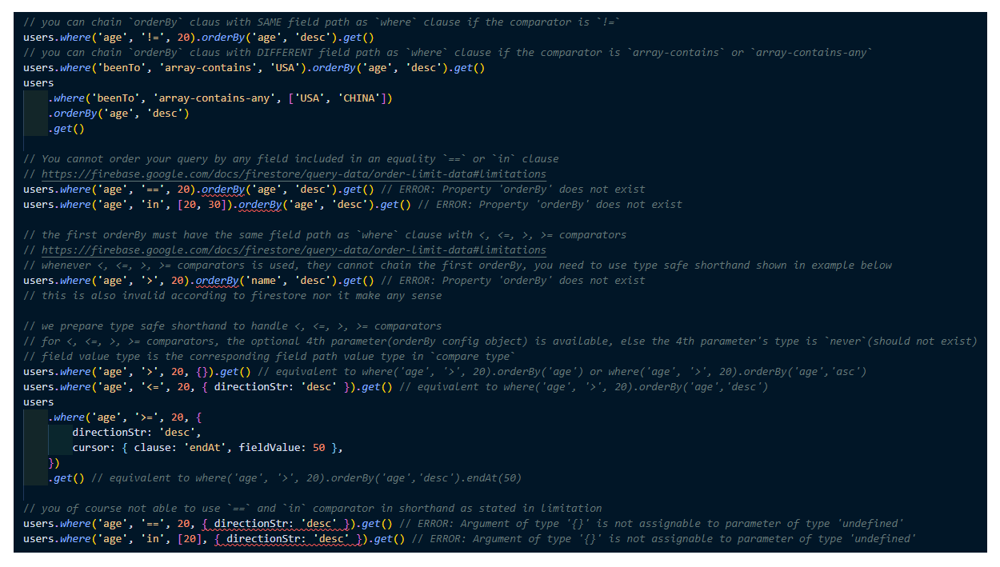
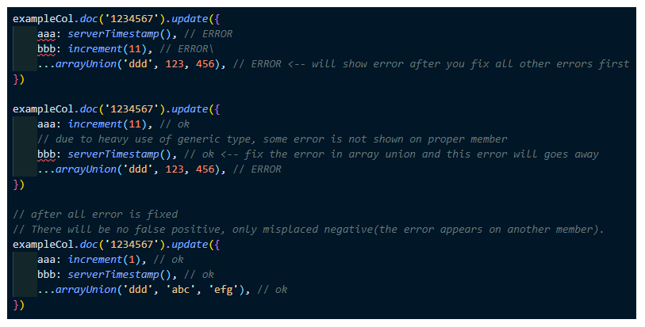

<!-- markdownlint-disable MD010 -->

# firelord(BETA, Nodejs)

[](https://www.npmjs.com/package/firelord) [](https://github.com/tylim88/firelord/blob/master/LICENSE) [](https://github.com/tylim88/firelord/pulls)

🐤 Write truly scalable firestore code with complete deep typing firestore wrapper, no more typing hell in your firestore code.

💪🏻 handle object, array, array object, object array...and all kinds of type, regardless of the nesting level!

🚀 All read and write operation are typed, query field path, field value, collection path, document path, everything is typed!

🔥 Automatically convert all value type to corresponding read type, write type and compare type(good at handling timestamp and field value).

✋🏻 Not only it safeguards your types, but it also stops you from making any incorrect implementation(use the wrapper incorrectly).

💥 Even the seemly untyped-able Firestore Field Value(serverTimestamp, arrayRemove, arrayUnion and increment) is taken care of, EVERYTHING is typed, NO TYPE IS LEFT BEHIND!!

✨ Api closely resemble firestore API, low learning curve.

🌈 Strictly onetime setup per document. Once configured, you are ready, no more confusing setup in the future, simplicity at its finest.

🐉 Zero dependencies.

⛲️ Out of box typescript support.

Variants:

1. [react native](https://www.npmjs.com/package/firelordrn)
2. [js](https://www.npmjs.com/package/firelordjs)

## 🦙 Purpose

You need to prepare 3 sets of data types to use firestore properly, best example is sever timestamp, when read, it is `Firestore.Timestamp`; when write, it is `Firestore.FieldValue`; and finally when compare, it is `Date|Firestore.Timestamp`.

Unfortunately `withConverter` is not enough to solve the type problems, there is still no feasible solutions to deal with type like date, firestore.Timestamp, number and array where different types are needed in read, write and compare(query). This library is a wrapper that introduces deep type solutions to handle each case.

Not only does the wrapper deal with data types, but it also provides type safety for collection path, document path, firestore limitations(whenever is possible).

The best thing of all: it handles complex data types and types all their operations.

require typescript 4.1 and above

Overview:

- generate read(get operation), write type(set/update operation) and compare type(for query) for field value, example:
  - server timestamp: `{write: Firestore.FieldValue, read: Firestore.Timestamp, compare: Date | Firestore.Timestamp}`
  - number: `{write: FieldValue | number, read: number, compare:number}`
  - xArray: `{write: x[] | FieldValue, read: x[], compare: x[]}`
  - see [conversion table](#-conversion-table) for more
- `Firestore.FieldValue`, `Firestore.TimeStamp`,`Firestore.GeoPoint`,`Date` are treated as primitive types.
- Preventing you from explicitly assign `undefined` to partial member in operation like `set`(with merge options) or `update` while still allowing you to skip that member.(There is option to explicitly assign `undefined` if you still want to).
- Preventing you from write stranger member (not exist in type) into `set`,`create` and `update` operations, stop unnecessary data from entering firestore.
- One time setting per document type: define a data type, a collection path and a document path, and you are ready to go.
  - type collection path, collection group path and document path.
  - auto generate sub collection path type.
- auto generate `updatedAt` and`createdAt` timestamp.
  - auto update `updatedAt` server timestamp to **update** operation.
  - auto add `createdAt` and `updatedAt` server timestamp to **create** and **set** operation.
- type complex data type like nested object, nested array, object array, array object and all their operations regardless of their nesting level!! Read [Complex Data Typing](#-complex-data-typing) for more info.
  
- preventing user from chain <`offset`> and <`limit` and `limit to last`> for the 2nd time.

  

- much better `where` and `orderBy` clause
  - field values are typed accordingly to field path
  - comparators depend on field value type, eg you cannot apply `array-contains` operator onto non-array field value
  - whether you can chain orderBy clause or not is depends on the comparator's value, this is according to [orderBy limitation](https://firebase.google.com/docs/firestore/query-data/order-limit-data#limitations), see image below. Go to [Order And Limit](#-collection-operations-order-and-limit) for documentation.
    
- The 4 musketeers: serverTimestamp(FieldValue), arrayRemove(FieldValue), arrayUnion(FieldValue) and increment(FieldValue) are now typed!

  

- and much more!

## 🦜 Getting Started

```bash
npm i firelord
```

### Collection

```ts
import { firelord, Firelord } from 'firelord'

// create wrapper
const wrapper = firelord(firestore)

// use base type to generate read and write type
type User = Firelord.ReadWriteCreator<
	{
		name: string
		age: number
		birthday: Date
		joinDate: Firelord.ServerTimestamp
		beenTo: ('USA' | 'CANADA' | 'RUSSIA' | 'CHINA')[]
	}, // base type
	'Users', // collection path type
	string // document path type
>

// implement wrapper
const userCreator = wrapper<User>()
// collection reference
const users = userCreator.col('Users') // collection path type is "Users"
// collection group reference
const userGroup = userCreator.colGroup('Users') // collection path type is "Users"
// document reference
const user = users.doc('1234567890') // document path is string
```

if you need the types, here is how you get it.

```ts
// import User

// read type
type UserRead = User['read'] // {name: string, age:number, birthday:firestore.Timestamp, joinDate: firestore.Timestamp, beenTo:('USA' | 'CANADA' | 'RUSSIA' | 'CHINA')[], createdAt: firestore.Timestamp, updatedAt: firestore.Timestamp}

// write type
type UserWrite = User['write'] // {name: string, age:number|FirebaseFirestore.FieldValue, birthday:firestore.Timestamp | Date, joinDate:FirebaseFirestore.FieldValue, beenTo:('USA' | 'CANADA' | 'RUSSIA' | 'CHINA')[] | FirebaseFirestore.FieldValue, createdAt: FirebaseFirestore.FieldValue, updatedAt: FirebaseFirestore.FieldValue}

// compare type
type UserCompare = User['compare'] // {name: string, age:number, birthday:Date | firestore.Timestamp, joinDate: Date | firestore.Timestamp, beenTo:('USA' | 'CANADA' | 'RUSSIA' | 'CHINA')[], createdAt: Date | firestore.Timestamp, updatedAt: Date | firestore.Timestamp}
```

### Sub-Collection

This is how you define a sub-collection, just plug in parent type into the type generator's 4th parameter and the wrapper know this is a sub-collection.

Even the collection group path is properly generated for you, easy-peasy.

```ts
// import User
// import Firelord
// import wrapper

// subCollection of User
type Transaction = Firelord.ReadWriteCreator<
	{
		amount: number
		date: Firelord.ServerTimestamp
		status: 'Fail' | 'Success'
	}, // base type
	'Transactions', // collection path type
	string, // document path type
	User // insert parent collection, it will auto construct the sub collection path for you
>

// implement the wrapper
const transactions = wrapper<Transaction>().col('Users/283277782/Transactions') // the type for col is `User/${string}/Transactions`
const transactionGroup = wrapper<Transaction>().colGroup('Transactions') // the type for collection group is `Transactions`
const transaction = users.doc('1234567890') // document path is string
```

Normally a collection should only have one type of document(recommended), however if your collection has more than one type of document, the solution is to simply define more base type.

## 🦔 Conversion Table

The wrapper generate 3 types based on base type:

1. read type: the type you get when you call `get` or `onSnapshot`.
2. write type: the type for `set`, `create`, `update` operations.
3. compare type: the type you use in `where` clause.

All read operations return `read type` data, all write operations require `write type` data and all queries require `compare type` data, you only need to define `base type` and the wrapper will generate the other 3 types for you.

You don't need to do any kind of manipulation onto `read`, `write` and `compare` types, nor do you need to use them.

The documentation explains how the types work, the wrapper itself is intuitive in practice. thoroughly refer to the documentation only if you hit the dead end.

You SHOULD NOT try to memorize how the typing work, keep in mind the purpose is not for you to fit into the type, but is to let the type GUIDE you.

| Base                             | Read                  | Write                                                                                                              | Compare                                      |
| -------------------------------- | --------------------- | ------------------------------------------------------------------------------------------------------------------ | -------------------------------------------- |
| number                           | number                | number \| FirebaseFirestore.FieldValue(increment\*)                                                                | number                                       |
| string                           | string                | string                                                                                                             | string                                       |
| null                             | null                  | null                                                                                                               | null                                         |
| undefined                        | undefined             | undefined                                                                                                          | undefined                                    |
| Date                             | firestore.Timestamp   | firestore.Timestamp \|Date                                                                                         | firestore.Timestamp \|Date                   |
| firestore.Timestamp              | firestore.Timestamp   | firestore.Timestamp \|Date                                                                                         | firestore.Timestamp \|Date                   |
| Firelord.ServerTimestamp\*\*\*   | firestore.Timestamp   | FirebaseFirestore.FieldValue(ServerTimestamp\*)                                                                    | firestore.Timestamp \|Date                   |
| firestore.GeoPoint               | firestore.GeoPoint    | firestore.GeoPoint                                                                                                 | firestore.GeoPoint                           |
| object\*\*                       | object                | object                                                                                                             | object                                       |
| number[]                         | number[]              | number[] \|FirebaseFirestore.FieldValue(arrayRemove/arrayUnion\*)                                                  | number[]                                     |
| string[]                         | string[]              | string[] \|FirebaseFirestore.FieldValue(arrayRemove/arrayUnion\*)                                                  | string[]                                     |
| null[]                           | null[]                | null[] \|FirebaseFirestore.FieldValue(arrayRemove/arrayUnion\*)                                                    | null[]                                       |
| undefined[]                      | undefined[]           | undefined[] \|FirebaseFirestore.FieldValue(arrayRemove/arrayUnion\*)                                               | undefined[]                                  |
| Date[]                           | firestore.Timestamp[] | (firestore.Timestamp \|Date )[] \|FirebaseFirestore.FieldValue(arrayRemove/arrayUnion\*)                           | (Date \| firestore.Timestamp)[]              |
| firestore.Timestamp[]            | firestore.Timestamp[] | (firestore.Timestamp \|Date )[] \|FirebaseFirestore.FieldValue(arrayRemove/arrayUnion\*)                           | (Date \| firestore.Timestamp)[]              |
| Firelord.ServerTimestamp[]\*\*\* | firestore.Timestamp[] | FirebaseFirestore.FieldValue (ServerTimestamp*)[] \|FirebaseFirestore.FieldValue(arrayRemove/arrayUnion*)          | (Date \| firestore.Timestamp)[]              |
| firestore.GeoPoint[]             | firestore.GeoPoint[]  | firestore.GeoPoint[]                                                                                               | firestore.GeoPoint[]                         |
| object[]\*\*                     | object[]              | object[]                                                                                                           | object[]                                     |
| n-dimension array                | n-dimension array     | n-dimension array \| FirebaseFirestore.FieldValue(arrayRemove/arrayUnion\*) only supported for 1st dimension array | compare only elements in 1st dimension array |

you can union any types, it will generate the types distributively, for example type `string | number | number[] | (string | number)[] | (string | number)[][] | (string | number)[][][]` generates:

read type: `string | number | number[] | (string | number)[] | (string | number)[][] | (string | number)[][][]`

write type: `string | number | FirebaseFirestore.FieldValue | number[] | (string | number)[] | (string | number)[][] | (string | number)[][][]`

compare type: `string | number | number[] | (string | number)[] | (string | number)[][] | (string | number)[][][]`

In practice, any union is not recommended, data should has only one type, except `undefined` or `null` union that bear certain meaning(value missing or never initialized).

NOTE: `Date | firestore.Timestamp`, `(Date | firestore.Timestamp)[]`, and `Date[] | firestore.Timestamp[]` unions are redundant, because `Date` and `firestore.Timestamp` generate same `read`, `write` and `compare` types.

\* Any FirebaseFirestore.FieldValue type will be replaced by masked type, see [Handling Firestore Field Value](#-handling-firestore-field-value) for more info.

\*\* the wrapper flatten nested object, however, there are not many things to do with object[] type due to how firestore work, read [Complex Data Typing](#-complex-data-typing) for more info.

\*\*\* `Firelord.ServerTimestamp`(underneath it is `ServerTimestamp`) is a reserved type. You cannot use it as a string literal type, use this type if you want your type to be `Firestore.ServerTimestamp`.

## 🐘 Document operations: Write, Read and Listen

All the document operations API is like firestore [write](https://firebase.google.com/docs/firestore/manage-data/add-data), [read](https://firebase.google.com/docs/firestore/query-data/get-data) and [listen](https://firebase.google.com/docs/firestore/query-data/listen).

```ts
// import user

import { firestore } from 'firebase-admin'

// get data(type is `read type`)
user.get().then(snapshot => {
	const data = snapshot.data()
})

// listen to data(type is `read type`)
user.onSnapshot(snapshot => {
	const data = snapshot.data()
})

const ServerTimestamp = firestore.FieldValue.ServerTimestamp()

// create if only exist, else fail
// require all `write type` members(including partial member in the `base type`) except `updatedAt` and `createdAt`
// auto add `createdAt` and `updatedAt`
user.create({
	name: 'John',
	age: 24,
	birthday: new Date(1995, 11, 17),
	joinDate: ServerTimestamp,
	beenTo: ['RUSSIA'],
})

// create if not exist, else overwrite
// although it can overwrite, we intend this to use as create
// require all `write type` members(including partial member in the `base type`) except `updatedAt` and `createdAt`
// auto add `createdAt` and `updatedAt`
user.set({
	name: 'John',
	age: 24,
	birthday: new Date(1995, 11, 17),
	joinDate: ServerTimestamp,
	beenTo: ['RUSSIA'],
})

// create if not exist, else update
// although it can create if not exist, we intend this to use as an update operation
// all member are partial members, you can leave any of the member out, however typescript will stop you from explicitly assign `undefined` value to any of the member unless you union the type with `undefined` or mark it as optional in the `base type`
// auto update `updatedAt`
// the only value for `merge` is `true`
// NOTE: there will be typescript missing property error if all member is not present, to fix this just fill in `{ merge:true }` in option as shown below.
user.set({ name: 'Michael' }, { merge: true })

// create if not exist, else update
// although it can create if not exist, we intend this to use as an update operation
// all members are partial members, you can leave any of the members out, however, typescript will stop you from explicitly assigning `undefined` value to any of the members unless you union the type with `undefined` or mark it as optional in the `base type`
// auto update `updatedAt`
// the only value for `merge` is `true`
// NOTE: there will be a missing property error from typescript if all member is not present, to fix this just fill in `{ merge:true }` in option as shown below.
user.set(
	{ name: 'Michael', age: 32, birthday: new Date(1987, 8, 9) },
	{ mergeField: ['name', 'age'] } // update only `name` and `age` fields
)

// update if exist, else fail
// all members are partial members, you can leave any of the members out, however, typescript will stop you from explicitly assigning `undefined` value to any of the members unless you union the type with `undefined` or mark it as optional in the `base type`
// auto update `updatedAt`
user.update({ name: 'Michael' })

// delete document
user.delete()
```

## 🦩 Document operations: Batch

all API are similar to [firestore batch](https://firebase.google.com/docs/firestore/manage-data/transactions#batched-writes), the only difference is, the batch is member of doc, hence you don't need to define document reference.

```ts
// import user
import { firestore } from 'firebase-admin'

// implement the wrapper
const user = wrapper<User>().col('Users').doc('1234567890')

// create batch
const batch = firestore().batch()
const userBatch = user.batch(batch)

// delete document
userBatch.delete()

// create if exist, else fail
// require all `write type` members(including partial member in the `base type`) except `updatedAt` and `createdAt`
// auto add `updatedAt` and `createdAt`
userBatch.create({ name: 'Michael', age: 32, birthday: new Date(1987, 8, 9) })

// update if exist, else fail
// all members are partial members, you can leave any of the members out, however, typescript will stop you from explicitly assigning `undefined` value to any of the members unless you union the type with `undefined` or mark it as optional in the `base type`
// auto update `updatedAt`
userBatch.update({ name: 'Ozai' })

//commit
batch.commit()
```

## 🐠 Document Operations: Transaction

all API is like [firestore transaction](https://firebase.google.com/docs/firestore/manage-data/transactions#batched-writes), the only difference is, the batch is a member of doc, hence you don't need to define document reference.

```ts
// import user

user.runTransaction(async transaction => {
	// get `read type` data
	await transaction.get().then(snapshot => {
		const data = snapshot.data()
	})

	// create if only exist, else fail
	// require all `write type` members(including partial member in the `base type`) except `updatedAt` and `createdAt`
	// auto add `createdAt` and `updatedAt`
	await transaction.create({
		name: 'John',
		age: 24,
		birthday: new Date(1995, 11, 17),
		joinDate: ServerTimestamp,
		beenTo: ['RUSSIA'],
	})

	// create if not exist, else overwrite
	// although it can overwrite, we intended this to use as create
	// require all `write type` members(including partial member in the `base type`) except `updatedAt` and `createdAt`
	// auto add `createdAt` and `updatedAt`
	user.set({
		name: 'John',
		age: 24,
		birthday: new Date(1995, 11, 17),
		joinDate: ServerTimestamp,
		beenTo: ['RUSSIA'],
	})

	// create if not exist, else update
	// although it can create if not exist, we intend this to use as an update operation
	// all members are partial members, you can leave any of the members out, however, typescript will stop you from explicitly assigning `undefined` value to any of the members unless you union the type with `undefined` or mark it as optional in the `base type`
	// auto update `updatedAt`
	// the only value for `merge` is `true`
	// NOTE: there will be a missing property error from typescript if all member is not present, to fix this just fill in `{ merge:true }` in the option as shown below.
	await transaction.set({ name: 'Michael' }, { merge: true })

	// create if not exist, else update
	// although it can create if not exist, we intend this to use as an update operation
	// all members are partial members, you can leave any of the members out, however, typescript will stop you from explicitly assigning `undefined` value to any of the members unless you union the type with `undefined` or mark it as optional in the `base type`
	// auto update `updatedAt`
	// the only value for `merge` is `true`
	// NOTE: there will be a missing property error from typescript if all member is not present, to fix this just fill in `{ merge:true }` in the option as shown below.
	await transaction.set(
		{ name: 'Michael', age: 32, birthday: new Date(1987, 8, 9) },
		{ mergeField: ['name', 'age'] } // update only `name` and `age` fields
	)

	// update if exist, else fail
	// all member are partial members, you can leave any of the member out, however typescript will stop you from explicitly assign `undefined` value to any of the member unless you union the type with `undefined` or mark it as optional in the `base type`
	// auto update `updatedAt`
	await transaction.update({ name: 'Michael' })
	// delete document
	await transaction.delete()

	// keep in mind you need to return a promise in transaction
	// example code here is just an example to show API, this is not the correct way to do it
	// refer firestore guide https://firebase.google.com/docs/firestore/manage-data/transactions
	return Promise.resolve('')
})
```

## 🌞 Collection Operations: Query

All the API are like [firestore query](https://firebase.google.com/docs/firestore/query-data/queries), clauses are chain-able.

```ts
// import users

// non array data type
// the field path is the keys of the `base type`
// type of opStr is '<' | '<=' | '==' | '!=' | '>=' | '>' | 'not-in' | 'in'
// if type of opStr is '<' | '<=' | '==' | '!=' | '>=' | '>', the value type is same as the member's type in `compare type`
users.where('name', '==', 'John').get()
// if type of opStr is 'not-in' | 'in', the value type is array of member's type in `compare type`
users.where('name', 'in', ['John', 'Michael']).get()

// array data type
// the field path is the keys of the `base type`
// type of `opStr` is  'in' | 'array-contains-any'
// if type of opStr is 'array-contains', the value type is the non-array version of member's type in `compare type`
users.where('beenTo', 'array-contains', 'USA').get()
// if type of opStr is 'array-contains-any', the value type is same as the member's type in `compare type`
users.where('beenTo', 'array-contains-any', ['USA']).get()
// if type of opStr is 'in', the value type is the array of member's type in `compare type`
users.where('beenTo', 'in', [['CANADA', 'RUSSIA']]).get()
```

## 🐳 Collection Operations: Order And Limit

all the API are like [firestore order and limit](https://firebase.google.com/docs/firestore/query-data/queries) with slight differences, but work the same, clauses are chain-able.

The type rule obey firestore [orderBy limitation](https://firebase.google.com/docs/firestore/query-data/order-limit-data#limitations).

Read this before proceeding: [Firestore OrderBy and Where conflict](https://stackoverflow.com/a/56620325/5338829) and [firestore index](https://www.fullstackfirebase.com/cloud-firestore/indexes) on how to overcome certain `orderBy` limitation, this is also considered into typing.

Any `orderBy` that does not follow `where` clause does not abide by the rule and limitation mentioned above.

Note: The wrapper will not stop you from using multiple `orderBy` clause because multiple `orderBy` clause is possible, read [Multiple orderBy in firestore](https://stackoverflow.com/a/66071503/5338829) and [Ordering a Firestore query on multiple fields](https://cloud.google.com/firestore/docs/samples/firestore-query-order-multi).

Tips: to make things easier, whenever you want to use `where` + `orderBy`, use the shorthand form (see example code below).

```ts
// import users

// the field path is the keys of the `compare type`(basically keyof `base type` plus `createdAt` and `updatedAt`)

// if the member value type is array, type of `opStr` is  'in' | 'array-contains'| 'array-contains-any'
// if type of opStr is 'array-contains', the value type is the non-array version of member's type in `compare type`
users.where('beenTo', 'array-contains', 'USA').get()
// if type of opStr is 'array-contains-any', the value type is same as the member's type in `compare type`
users.where('beenTo', 'array-contains-any', ['USA']).get()
// if type of opStr is 'in', the value type is the array of member's type in `compare type`
users.where('beenTo', 'in', [['CANADA', 'RUSSIA']]).get()

// orderBy field path only include members that is NOT array type in `compare type`
users.orderBy('name', 'desc').limit(3).get()

// for `array-contains` and `array-contains-any` comparators, you can chain `orderBy` clause with DIFFERENT field path
users.where('beenTo', 'array-contains', 'USA').orderBy('age', 'desc').get()
users
	.where('beenTo', 'array-contains-any', ['USA', 'CHINA'])
	.orderBy('age', 'desc')
	.get()

// for '==' | 'in' comparators:
// no order for '==' | 'in' comparator for SAME field name, read https://stackoverflow.com/a/56620325/5338829 before proceed
users.where('age', '==', 20).orderBy('age', 'desc').get()
// '==' | 'in' is order-able with DIFFERENT field name but need to use SHORTHAND form to ensure type safety
users.where('age', '==', 20).orderBy('name', 'desc').get()
// shorthand ensure type safety, equivalent to where('age', '>', 20).orderBy('name','desc')
users.where('age', '==', 20, { fieldPath: 'name', directionStr: 'desc' }).get()
// again, no order for '==' | 'in' comparator for SAME field name
users.where('age', '==', 20, { fieldPath: 'age', directionStr: 'desc' }).get()

// for '<' | '<=]| '>'| '>=' comparator
// no order for '<' | '<=]| '>'| '>=' comparator for DIFFERENT field name
users.where('age', '>', 20).orderBy('name', 'desc').get()
// '<' | '<=]| '>'| '>=' is oder-able with SAME field name but need to use SHORTHAND form to ensure type safety
users.where('age', '>', 20).orderBy('age', 'desc').get()
// equivalent to where('age', '>', 20).orderBy('age','desc')
users.where('age', '>', 20, { fieldPath: 'age', directionStr: 'desc' }).get()
// again, no order for '<' | '<=]| '>'| '>=' comparator for DIFFERENT field name
users.where('age', '>', 20, { fieldPath: 'name', directionStr: 'desc' }).get()

// for `not-in` and `!=` comparator, you can use normal and  shorthand form for both same and different name path
// same field path
users.where('name', 'not-in', ['John', 'Ozai']).orderBy('name', 'desc').get()
// different field path
users.where('name', 'not-in', ['John', 'Ozai']).orderBy('age', 'desc').get()
// shorthand different field path:
users
	.where('name', 'not-in', ['John', 'Ozai'], {
		fieldPath: 'age',
		directionStr: 'desc',
	})
	.get() // equivalent to where('name', 'not-in', ['John', 'Ozai']).orderBy('age','desc')
// shorthand same field path:
users
	.where('name', 'not-in', ['John', 'Ozai'], {
		fieldPath: 'name',
		directionStr: 'desc',
	})
	.get() // equivalent to where('name', 'not-in', ['John', 'Ozai']).orderBy('name','desc')

// same field path
users.where('name', '!=', 'John').orderBy('name', 'desc').get()
// different field path
users.where('name', '!=', 'John').orderBy('age', 'desc').get()
// shorthand different field path:
users
	.where('name', '!=', 'John', {
		fieldPath: 'age',
		directionStr: 'desc',
	})
	.get() // equivalent to where('name', '!=', 'John').orderBy('age','desc')
// shorthand same field path:
users
	.where('name', '!=', 'John', {
		fieldPath: 'name',
		directionStr: 'desc',
	})
	.get() // equivalent to where('name', '!=', 'John').orderBy('name','desc')
```

## 🌺 Collection Operations: Paginate And Cursor

API differ slightly from [firestore paginate and cursor](https://firebase.google.com/docs/firestore/query-data/query-cursors), the cursors became orderBy parameter, it still works the same as firestore original API, clauses are chain-able.

```ts
// import users

// field path only include members that is NOT array type in the `base type`
// field value type is the corresponding field path value type in `compare type`
// value of cursor clause is 'startAt' | 'startAfter' | 'endAt' | 'endBefore'
users.orderBy('age', 'asc', { clause: 'startAt', fieldValue: 20 }).offset(5) // equivalent to orderBy("age").startAt(20).offset(5)
// usage with where
users
	.where('name', '!=', 'John')
	.orderBy('age', 'desc', { clause: 'endAt', fieldValue: 50 })
// equivalent to shorthand
users
	.where('name', '!=', 'John', {
		fieldPath: 'age',
		directionStr: 'desc',
		cursor: { clause: 'endAt', fieldValue: 50 },
	})
	.get() // equivalent to where('name', '!=', 'John').orderBy('age','desc').endAt(50)
```

## 🌵 Collection Group

Api is exactly the same as Collection Operations: [Query](#-collection-operations-query), [Order And Limit](#-collection-operations-order-and-limit), [Paginate And Cursor](Firelord#-collection-operations-paginate-and-cursor)

simply use collection group reference instead of collection reference, refer back [Getting Started](#-getting-started) on how to create collection group reference.

## 🌻 Complex Data Typing

As for (nested or not)object[] type, its document/collection operations work the same as other arrays, it will not flatten down due to how firestore work, read [Firestore how to query nested object in array](https://stackoverflow.com/a/52906042/5338829). You cannot query(or set, update, etc) object member or array member in the array, nested or not, a similar rule applies to a nested array.

Long thing short, anything that is in the array, be it another array or another object with array member, will not get flattened and will not have its field path built nor you can use field value (arrayRemove, arrayUnion and increment) except serverTimestamp field value.

However, it is very much possible to query and write a specific object member (nested or not), as long as it is not in an array, the typing logic works just like other primitive data types' document/collection operation because the wrapper will flatten all the in object type, nested or not.

NOTE: read type does not flatten, because there is no need to

Last, both object, object[], array, array object, nested or not, no matter how deep, all the field values (not specifically referring to Firestore.FieldValue, but field value) of all data types will undergo data type conversion.

consider this example

```ts
// import Firelord
// import wrapper

type Nested = Firelord.ReadWriteCreator<
	{
		a: number
		b: { c: string }
		d: { e: { f: Date[]; g: { h: { a: number }[] } } }
	},
	'Nested',
	string
>

// read type, does not flatten because no need to
type NestedRead = Nested['read'] // {a: number, b: { c: string }, d: { e: { f: FirebaseFirestore.Timestamp[], g: { h: { a: number }[] } } }, createdAt: firestore.Timestamp, updatedAt: firestore.Timestamp	}

// write type
type NestedWrite = Nested['write'] // {a: number | FirebaseFirestore.FieldValue, "b.c": string, "d.e.f": FirebaseFirestore.FieldValue | (FirebaseFirestore.Timestamp | Date)[], "d.e.g.h": FirebaseFirestore.FieldValue | { a: number }[], createdAt: FirebaseFirestore.FieldValue, updatedAt: FirebaseFirestore.FieldValue}

// compare type
type NestedCompare = Nested['compare'] // {a: number, "b.c": string, "d.e.f": (FirebaseFirestore.Timestamp | Date)[], "d.e.g.h": FirebaseFirestore.FieldValue | { a: number }[], createdAt: Date | firestore.Timestamp, updatedAt: Date | firestore.Timestamp}

const nested = wrapper<Nested>().col('Nested')
```

As you can see, the object flattens down and the wrapper converted all the value types

so the next question is, how are you going to shape your object so you can use it in `set`, `create` and `update` operation?

consider this example:

```ts
// import nested

const data = {
	a: 1,
	b: { c: 'abc' },
	d: { e: { f: [new Date(0)], g: { h: [{ a: '123' }] } } },
}
nested.doc('123456').set(data) // ERROR, because the input type is {a: number | FirebaseFirestore.FieldValue, "b.c": string, "d.e.f": FirebaseFirestore.FieldValue | (FirebaseFirestore.Timestamp | Date)[], "d.e.g.h": FirebaseFirestore.FieldValue | { a: number }[]}
nested.doc('123456').update(data) // ERROR, because the input type is PartialNoExplicitUndefinedNoExcessMember<{a: number | FirebaseFirestore.FieldValue, "b.c": string, "d.e.f": FirebaseFirestore.FieldValue | (FirebaseFirestore.Timestamp | Date)[], "d.e.g.h": FirebaseFirestore.FieldValue | { a: number }[]}>
```

to flatten your object, import `flatten` (Reminder, you don't need to flatten non-nested object, but nothing will happen if you accidentally did it)

solution:

```ts
// import nested

import { flatten } from 'firelord'

const data = {
	a: 1,
	b: { c: 'abc' },
	d: { e: { f: [new Date(0)], g: { h: [{ a: 123 }] } } },
}

nested.doc('123456').set(flatten(data)) // ok
nested.doc('123456').update(flatten(data)) // ok
```

As for query, since the type is flattened, just query like you would normally query in firelord.

## Handling Firestore Field Value

Firestore field value, aka serverTimestamp, arrayRemove, arrayUnion and increment, they all return `FieldValue`, this is problematic, as you may use increment on an array or serverTimeStamp on a number. Kudo to whoever design this for making our life harder.

The wrapper forbids you to use any firestore field value(serverTimestamp, arrayRemove, arrayUnion and increment) instance. We prepare another field value generator for you with the return type masked.

It still returns the same firestore field value but with a masked return type, conversion table below shows what mask the types.

| Field Value     | Masked Type                                                                                 | Note                              |
| --------------- | ------------------------------------------------------------------------------------------- | --------------------------------- |
| increment       | { 'please import `increment` from `firelord` and call it': number }                         |
| serverTimestamp | { 'please import `serverTimestamp` from `firelord` and call it': Firelord.ServerTimestamp } |
| arrayUnion      | { 'please import `arrayUnion` or `arrayRemove` from `firelord` and call it': T }            | where T is the type of the member |
| arrayRemove     | { 'please import `arrayUnion` or `arrayRemove` from `firelord` and call it': T }            | where T is the type of the member |

the masked type purposely looks weird, so nobody accidentally uses it for something else(as it could be dangerous, because the underneath value is firestore field value, not what typescript think it is)

this is how you use it

```ts
// import Firelord
// import wrapper
const { increment, arrayUnion, serverTimestamp } = wrapper().fieldValue

type HandleFieldValue = Firelord.ReadWriteCreator<
	{
		aaa: number
		bbb: Firelord.ServerTimestamp
		ddd: string[]
	},
	'HandleFieldValue',
	string
>

const handleFieldValue = wrapper<HandleFieldValue>().col('HandleFieldValue')

handleFieldValue.doc('1234567').set({
	aaa: arrayUnion('123', '456'), // ERROR
	bbb: increment(11), // ERROR
	ddd: arrayUnion(123, 456), // ERROR
})

handleFieldValue.doc('1234567').set({
	aaa: increment(1), // ok
	bbb: serverTimestamp(), // ok
	ddd: arrayUnion('123', '456'), // ok
})
```

The API is like firestore API, same working logic apply to complex data type.

if you try to use the original firestore field value, typescript will stop you.

## 🐕 Opinionated Elements

Code wise, there is one opinionated element in the wrapper, that is `createdAt` and `updatedAt` timestamp that add or update automatically.

when a document is created via `add`, `create` or `set` without option, two things will happen:

1. createdAt field path is created, and the value is firestore server timestamp(current server timestamp).
2. updatedAt field path is created, and the value is new Date(0), it starts at beginning of the time.

when a document is updated via `update` or `set` with option, updatedAt field path is updated and the value is firestore server timestamp.

This behaviour may be undesirable for some people. I will improve this in future by giving the developer choice.

Typing wise, there are few opinionated elements:

1. `set`(without option) and `create` operations require all member to present.
2. all write operations reject stranger members.
3. although `updatedAt` and `createdAt` is included in type, all write operation exclude them, which mean you cant write the value of `updatedAt` and `createdAt`.

I believe this decision is practical for cases and not planning to change it in the forseeable future.

## 🐇 Limitation

While the wrapper try to safeguard as much type as possible, some problem cannot be solved due to typing difficulty, or require huge effort to implement, or straight up not can be solved.

1. despite being able to type [orderBy limitation](https://firebase.google.com/docs/firestore/query-data/order-limit-data#limitations), there is no type-safe measurement for [Query Limitation](https://firebase.google.com/docs/firestore/query-data/queries) because the number of `where` clause is unforeseeable.
2. `ServerTimestamp` is a reserved type, you cannot use it as a string literal type.

## 💍 Utility

Since write operations reject stranger members (member that are not defined in base type), you can use [object-exact](https://www.npmjs.com/package/object-exact)(I am the author) to remove the stranger members, the library returns the exact type, so it should work well with the wrapper.

Do not use `flatten` for other purposes. If you need it, see [object-flat](https://www.npmjs.com/package/object-flat)(I am the author), it is a general purpose library. Do not use `object-flat` in firelord as it is not specifically tailored for firelord, use firelord native `flatten` instead.
